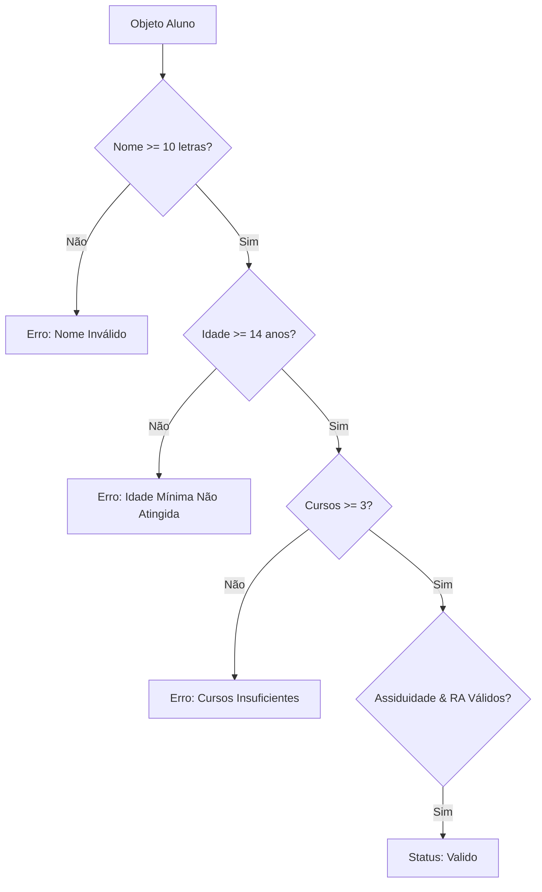

<div align="center">

# 🛡️ Validador de Cadastro de Alunos em JavaScript

<p align="center">
  
  
  
</p>

<p align="center">
  Motor de validação de regras de negócio em JavaScript para conferência cadastral de estudantes antes da matrícula.
</p>

---

</div>

## 📋 Regras de Validação



1. **`validarNome`:** Comprimento mínimo de caracteres.
2. **`validarIdade`:** Idade mínima de 14 anos.
3. **`validarCursos`:** Mínimo de 3 disciplinas selecionadas.
4. **`validarAssiduidade`:** Histórico de frequência em formato ISO.
5. **`validarRA`:** Formato de Registro Acadêmico.

---

## 🚀 Como Executar

```bash
# Clonar o repositório
git clone https://github.com/lucaxaviers/validacao-cadastro-alunos.git

# Acessar a pasta
cd validacao-cadastro-alunos

# Executar com Node.js
node ValidarCadastro.js
```

---

<div align="center">
  <sub>Desenvolvido no contexto de Engenharia de Software</sub>
</div>
